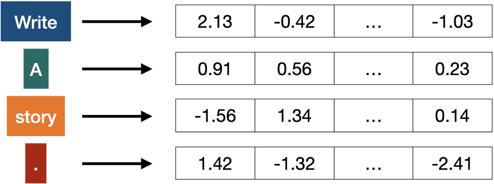
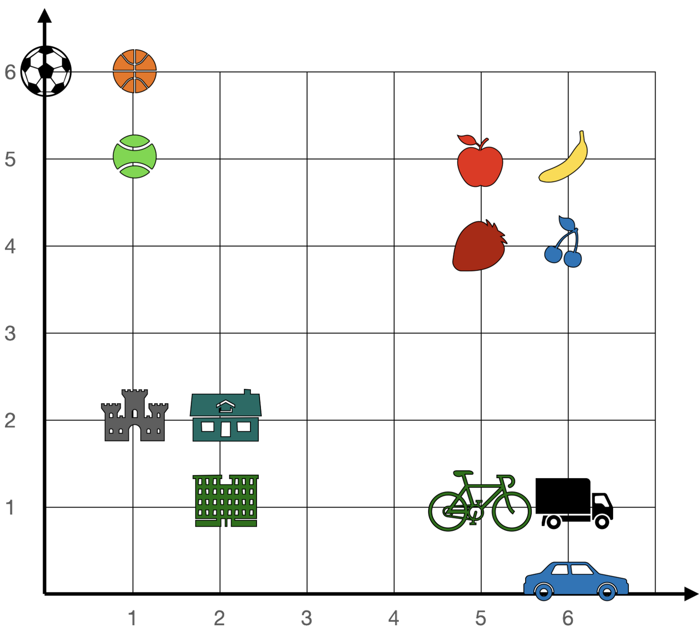

# Embedding

A **vector** is a list of numbers.

An **embedding** is a way to associate words with a list of numbers (a vector) in such a way that similar words are associated with numbers that are close by, and dissimilar words with numbers that are far away from each other.

You can also think of embeddings as a way of compressing information.

<figure><figcaption>
Embeddings: Turning words (tokens) into vectors (lists of numbers)
</figcaption></figure>

Think of a word embedding as trying to [lay out words in a kind of “meaning space”](https://reference.wolfram.com/language/ref/FeatureSpacePlot.html) in which words that are somehow “nearby in meaning” appear nearby in the embedding space.


One can think of an embedding as a way to try to represent the “essence” of something by an array of numbers—with the property that “nearby things” are represented by nearby numbers.


<figure><figcaption>
Similar words have embedded vectors that consist of similar numbers.
</figcaption></figure>

Examples:&#x20;

<figure><figcaption>
Embedding of words.
</figcaption></figure>

<figure><figcaption>
Embedding of numbers.
</figcaption></figure>

<figure><figcaption>
2D embedding of pet images. 
</figcaption></figure>
