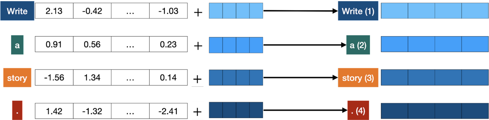

# Positional encoding

Positional encoding adds a **positional vector** to each word, in order to keep track of the positions of the words within a sentence.

This helps us represent sentences as vectors while preserving the order of words by adding extra information to each word's vector to show its position in the sentence.

**This ensures that even if the words are the same but in a different order, their vectors will be different, helping us understand the meaning of the sentence more accurately**.

Now we have **a unique vector** corresponding to the sentence which caries information **on all the words in the sentence and their order.**

<figure><figcaption>
Examples: The vectors corresponding to the words “Write”, “a”, “story”, and “.” become the modified vectors that carry information about their position, labeled “Write (1)”, “a (2)”, “story (3)”, and “. (4)”.
</figcaption></figure>


Recap so far: The words come in and get turned into tokens (tokenization), then their order gets taken into account (positional encoding). This gives us a vector for every token that we input into the model. The next step is to predict the next word in this sentence.

