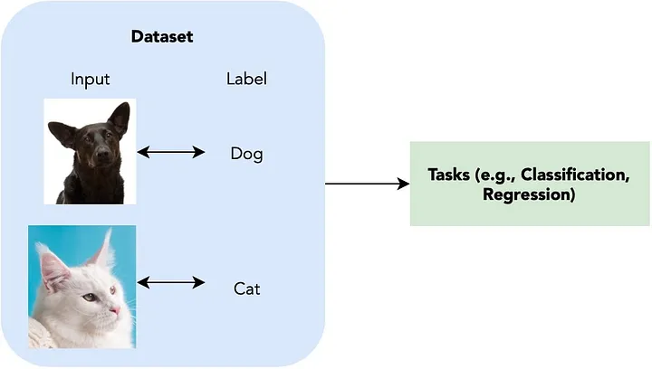

# How can you train a model?

<figure><figcaption></figcaption></figure>

Supervised: A model learns patterns from labeled data to make a prediction or classification. Requires you to spend time collecting and

Provides a set of input-output pairs such that we can learn an intermediate system that maps inputs to correct outputs.

* Semi-supervised: aims to address this problem: how do we use a small set of input-output pairs and another set of only inputs to optimize a model for a task that we are solving. Al ..png>)

Unsupervised: Input data have no corresponding classifications or labelling. The goal is to find underlying high-level patterns with each dataset.

*

    <figure><figcaption></figcaption></figure>
* Self-supervised: No labels given.. However, instead of finding high-level patterns for clustering, self-supervised learning attempts to still solve tasks that are traditionally targeted by supervised learning (e.g., image classification) without any labelings available.

Reinforcement: a machine learning training method based on rewarding desired behaviors and/or punishing undesired ones. In general, a reinforcement learning agent is able to perceive and interpret its environment, take actions and learn through trial and error.
