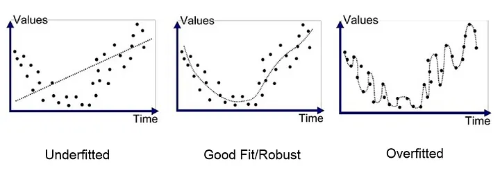

# What does it mean to 'train a model'?

It is created using an algorithm and trained on existing data to learn from examples, making it capable of making predictions or taking actions on new, unseen data.

The goal is to create a model (a learned function) that can ‘accurately’ predict an output given new output. By adjusting your architectures, data, and parameters, you can change you how you learn weights, and can build new models to better represent reality

.

<figure><figcaption></figcaption></figure>

<figure><figcaption></figcaption></figure>

weights — what is being learned&#x20;

bias — systematic error or assumptions made in architecting your model that deviates the predictions from the true value
