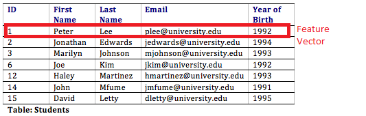

# What is a feature set?

Also known as feature vector or feature representation, refers to a collection of individual features or attributes that describe an object or data point.

<figure><figcaption></figcaption></figure>

